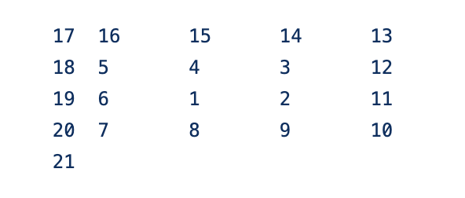

### 人工智能学院人工智能与深度学习系入学编程能力测试及预修资料

`---- by 慧科集团开课吧人工智能学院`


##### 祝贺你， 你已经马上要成为一名真正的算法⼯程师，不，准确得说，应该是一名⼈⼯智能⼯程师了。⽽且我们将要进⾏的是最有趣，最具有挑战性，也是使用最⼴的自然语⾔理解⽅向或者计算机视觉方向。文字和图像是我们日常输入最多的两种信息，希望⼤家已经做好了准备。


##### 但是，第一步，为了使得我们之后的课程能够合理继续，需要对⼤家的编程⽔平进⾏测试。请⼤家在以下三道题任选一道，完成编码并且测试输入和输出，观察程序的运行是否符合程序的预期。


##### 如果这三道题目对你⽽⾔都太过困难，你可以先自学预修课程，我们在测试题的附录为大家提供了预修资源建议。 这些课程都是公开、免费的课程资料，希望大家能够做出来我们的先修测试之后，再继续上课。


##### 可能你已经注意到了，我们的这三道题目，两道是关于数值计算/模拟计算的， 一道是关于语⾔解析的。 这三道题目每一道都是很有趣的，也是我们以后⼯作中会经常遇到的问题的一个缩影， 希望⼤家能花时间解决掉。不论你是选择的自然语言处理还是计算机视觉，这些题目你都可以做。这些程序考察的是编程能力，和具体的背景知识无关。 


##### 那现在还有一个问题，如何知道测试题是否做对呢？我们的每道题给大家都给出来足够的测试用例，请确保你在同样的输入下，你的程序和我们给出的测试用例是一样的。第三题是一个随机函数，这个除外。如果你的程序给出的结果和我们给出的参考答案一致，说明你的程序是正确的。如果，你对自己的程序不够有信心不确定是否正确，请及时联系微信小助手，或者在我们系统邮箱里回复进行咨询。我们的邮箱是 ai-college@kaikeba.com


#### 好的， 开始我们的激动的学习之旅吧！



##### 0. Programming Environment:

> Python 3.6 (Recommended), Python 2.7


#### 1. Spiral Memory



You come across an experimental new kind of memory stored on an infinite two-dimensional grid.

Each square on the grid is allocated in a spiral pattern starting at a location marked 1 and then counting up while spiraling outward. For example, the first few squares are allocated like this:

17  16  15  14  13
18   5   4   3  12
19   6   1   2  11
20   7   8   9  10
21  22  23---> …

While this is very space-efficient (no squares are skipped), requested data must be carried back to square 1 (the location of the only access port for this memory system) by programs that can only move up, down, left, or right. They always take the shortest path: the Manhattan Distance between the location of the data and square 1.

For example:

Data from square 1 is carried 0 steps, since it's at the access port. Data from square 12 is carried 3 steps, such as: down, left, left. Data from square 23 is carried only 2 steps: up twice.
Data from square 1024 must be carried 31 steps.
How many steps are required to carry the data from the square identified in your puzzle input all the way to the access port?


##### How to test your answer: 

+ If you input:  100000 Your Answer should be:  173
+ If you input:  2345678 Your Answer should be: 1347 

#### 2. Simple Number Finding


You are playing a card game with your friends. This game in China named “扎金花”. In this game, the 
2, 3, 5 are some simple powerful numbers. Because the combination of 2,3,5 is less than any other combinations
but greater than the AAA, which is the king in this game.  In today, you want to find if a number is a simple
number, in which their factors only include 2, 3 and 5.

So your task is to find out whether a given number is an amazing number.
 
E.g
```
Input: 6
Output: (2, 3)
Explanation: 6 = 2 x 3


Input: 8
Output: (2, 2, 2)
Explanation: 8 = 2 x 2 x 2
 
Input: 14
Output：None
Explanation: 14 is not amazing since it includes another prime factor 7.
```

How to check your answer: 

+ If you test 1845281250, your program should give (2, 3, 3, 3, 3, 3, 3, 3, 3, 3, 3, 5, 5, 5, 5, 5, 5)
+ If you test 3690562500, your program should give (2, 2, 3, 3, 3, 3, 3, 3, 3, 3, 3, 3, 5, 5, 5, 5, 5, 5);
+ If you test 1230187500, your program should give (2, 2, 3, 3, 3, 3, 3, 3, 3, 3, 3, 5, 5, 5, 5, 5, 5);
+ If you test 10023750, your program should give None;


##### 3. Random Chinese Sentence Generator


Writing a programming which could generate random Chinese sentences based on one grammar. 
Your input grammar is:
```
simple_grammar = """
sentence => noun_phrase verb_phrase noun_phrase => Article Adj* noun
Adj* => null | Adj Adj*
verb_phrase => verb noun_phrase

Article =>  一个 | 这个

noun =>   女人 |  篮球 | 桌子 | 小猫
verb => 看着 | 听着 | 看见

Adj =>   蓝色的 |  好看的 | 小小的 |  年轻的
"""
```


Your task is define a function called generate,  if we call generate(‘sentence’), you could see some sentences like:

```python

>> generate(“sentence”) 
 
Output: 这个蓝色的女人看着一个小猫


>> generate(“sentence”) 
 
Output: 这个好看的小猫坐在一个女人

```


好了， 看完这些题目， 如果你已经有了想法， 知道怎么做，那真是太好了，你已经具备了基础条件， 就差一些具体的 AI/机器学习算法知识了。
